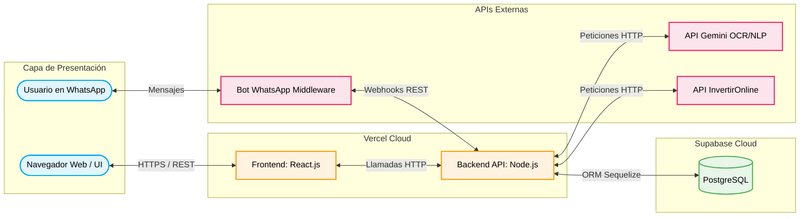
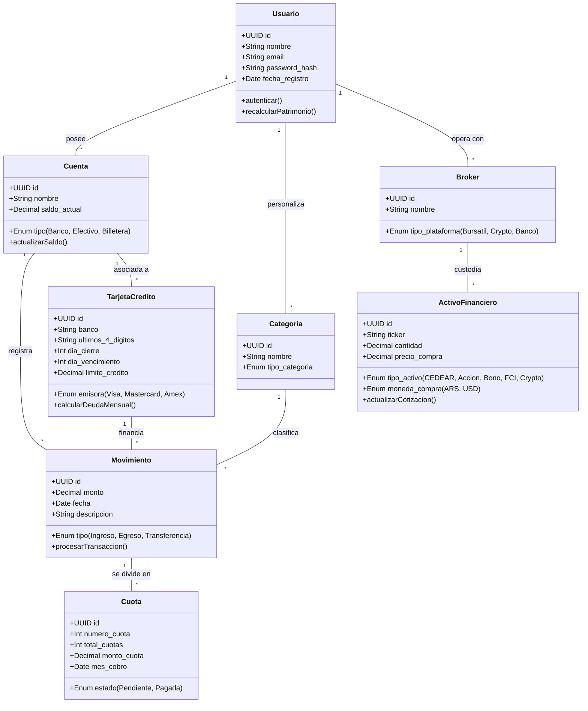
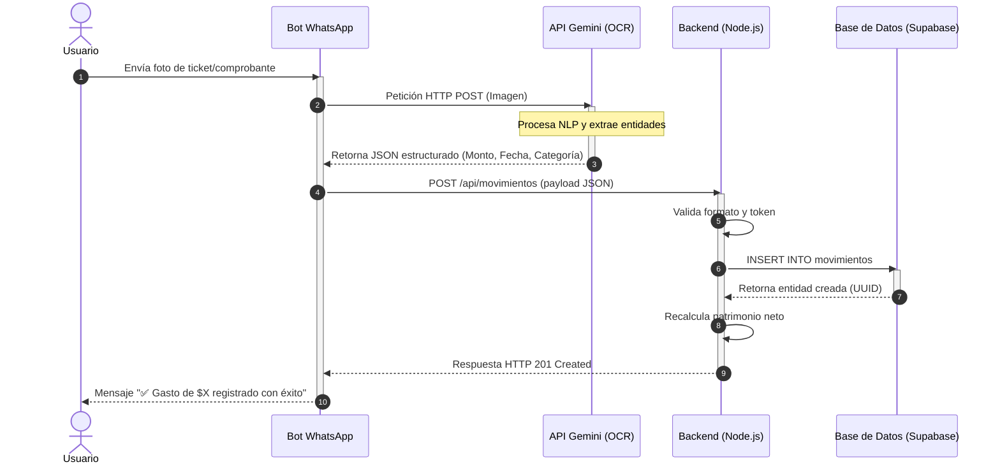

# 01 - Arquitectura General y Modelado UML

Este documento establece la arquitectura base, los patrones de diseño y los modelos de dominio orientados a objetos que DEBEN respetarse durante todo el ciclo de desarrollo del ERP de Finanzas Personales.

## 1. Arquitectura Cloud y Despliegue

El sistema adopta una arquitectura basada en la nube (Cloud-Native) orientada a microservicios y consumo de APIs de terceros. Se divide físicamente en cuatro grandes capas para garantizar el bajo acoplamiento y la alta cohesión.

## 2. Patrones de Diseño Utilizados

El desarrollo del sistema se fundamenta en los siguientes patrones de diseño de software:

* **MVC (Modelo-Vista-Controlador) Evolucionado:** Adaptado para arquitectura de API REST. El Frontend (React) actúa como Vista pura, los Routers/Controllers de Node.js validan los *requests*, y el ORM Sequelize gestiona los Modelos.
* **Patrón Singleton (Instancia Única):** OBLIGATORIO para la conexión a la base de datos (Supabase Client) y clientes de APIs externas (Gemini AI) para prevenir saturación de memoria en el entorno Serverless.
* **Patrón Facade (Fachada):** Utilizado en la capa de servicios del Backend para abstraer la complejidad de la comunicación con la IA (armado de prompts y parseo JSON).
* **Patrón Webhook / Observer:** Implementado para capturar los eventos asíncronos provenientes del bot de WhatsApp.

## 3. Modelo de Dominio (Diagrama de Clases)

El siguiente diagrama define las entidades estáticas, sus métodos clave y sus atributos con tipos de datos estrictos. Las relaciones de multiplicidad dictan cómo el ORM debe definir las asociaciones.

*Nota de Arquitectura:* La entidad `Broker` está normalizada y abstraída de `ActivoFinanciero`. Además, las `Cuotas` derivan estrictamente de la entidad `Movimiento` y NO de la `TarjetaCredito` para garantizar la integridad referencial.

## 4. Flujos de Interacción (Diagrama de Secuencia)

El flujo asíncrono principal (Carga Automatizada vía WhatsApp) requiere la orquestación temporal descrita a continuación. Ningún endpoint debe bloquear el *Event Loop* durante la consulta a la API de OCR.

