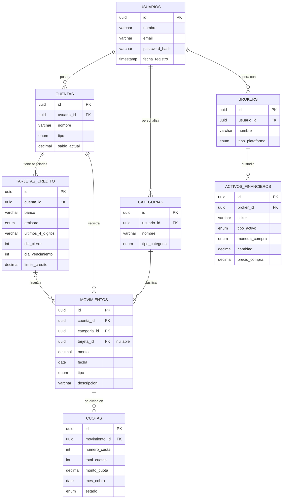

# 02 - Modelo de Datos Físico (DER) y Persistencia

Este documento define la estructura estricta de la base de datos relacional. 

**DIRECTIVA OBLIGATORIA PARA AGENTES:** * El motor de base de datos a utilizar es **PostgreSQL** (vía Supabase).
* TODAS las migraciones y modelos (Sequelize/Prisma) deben respetar exactamente los nombres de tablas, columnas, tipos de datos y relaciones (PK/FK) definidos en el siguiente diagrama ER. 
* No se permite alterar la normalización ni desnormalizar entidades sin autorización explícita.

## 1. Diagrama Entidad-Relación (ER)

## 2. Reglas de Negocio a Nivel Base de Datos

Para garantizar la integridad del sistema financiero, se deben aplicar las siguientes restricciones a nivel esquema (Constraints):

1. **Propiedades ACID:** Obligatorio el uso de transacciones (Transactions) al insertar un `MOVIMIENTO` que genere múltiples `CUOTAS` o altere el `saldo_actual` de una `CUENTA`. Si falla una inserción, se debe hacer *rollback* de todo.
2. **Tipado Estricto (Manejo de Dinero):** Queda estrictamente prohibido usar tipos `float` o `double` para valores monetarios. Se debe usar el tipo `DECIMAL` o `NUMERIC` en PostgreSQL para evitar problemas de redondeo en coma flotante.
3. **Claves Primarias (Seguridad):** Se utiliza `UUID` (Universally Unique Identifier) en lugar de enteros autoincrementales (`SERIAL`) para prevenir ataques de enumeración (IDOR) y facilitar la posible futura migración a un esquema de bases de datos distribuidas.
4. **Integridad Referencial:** * Eliminación en cascada (`ON DELETE CASCADE`) permitida desde `USUARIOS` hacia sus entidades hijas.
    * Eliminación restringida (`ON DELETE RESTRICT`) si se intenta borrar una `CUENTA`, `TARJETA_CREDITO` o `BROKER` que ya tenga `MOVIMIENTOS` o `ACTIVOS_FINANCIEROS` asociados.
5. **Seguridad (RLS):** Se debe habilitar Row Level Security (RLS) en Supabase en todas las tablas, garantizando que el `usuario_id` del token JWT coincida con el dueño de los registros.