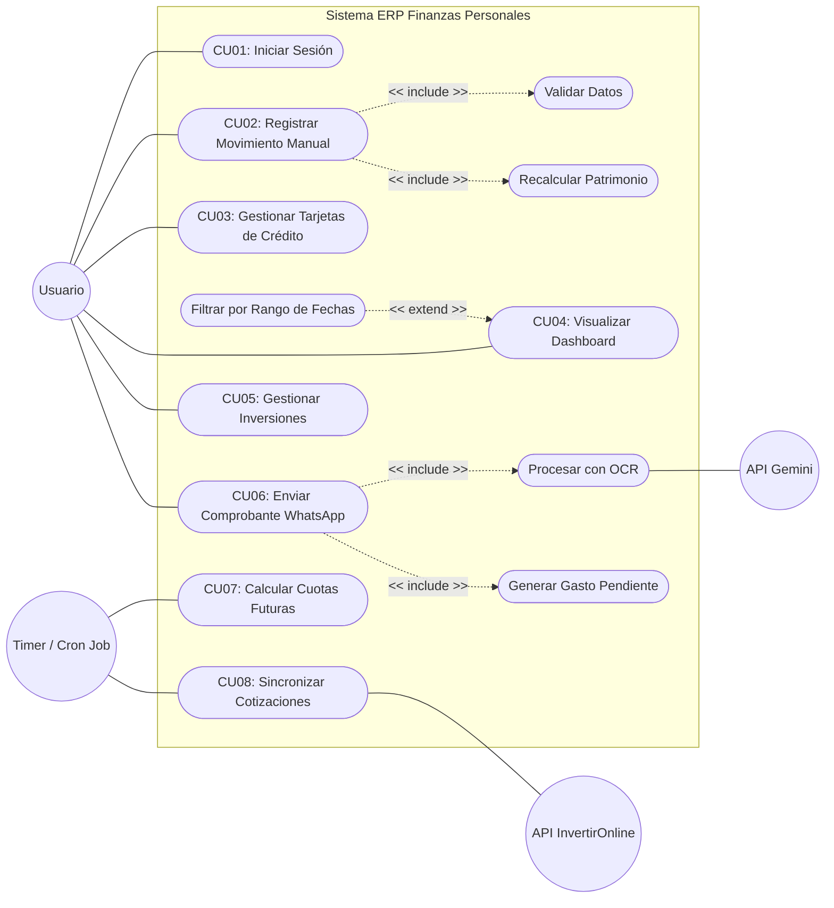

# 03 - Requerimientos Funcionales y Casos de Uso

Este documento define las funcionalidades exactas que el sistema debe exponer. 

**DIRECTIVA OBLIGATORIA PARA AGENTES:** * Cada Caso de Uso (CU) documentado aquí DEBE traducirse en uno o más *endpoints* en la API REST (Node.js) y su respectiva interfaz o integración (React / WhatsApp Bot).
* Los procesos marcados como `<< include >>` son funciones o *middlewares* reutilizables obligatorios.
* Prestar especial atención a los Actores Externos (APIs) y a los procesos disparados por el sistema (`Timer`), los cuales DEBEN implementarse mediante *Cron Jobs* o tareas programadas.

## 1. Diagrama de Casos de Uso General

## 2. Especificación de Casos de Uso (Lógica de Negocio)

### Módulo Core y Transacciones
* **CU01 - Iniciar Sesión:** Autenticación mediante JWT. Debe devolver el token y los datos básicos del usuario.
* **CU02 - Registrar Movimiento Manual:** El usuario ingresa un ingreso, egreso o transferencia vía Web.
  * **Include (Validar Datos - CU3):** El backend debe verificar que los montos sean positivos y las cuentas existan.
  * **Include (Recalcular Patrimonio - CU4):** Al insertar el movimiento, se debe actualizar automáticamente el `saldo_actual` de la `Cuenta` afectada usando una transacción SQL (ACID).
* **CU04 - Visualizar Dashboard:** Endpoint principal (GET) que consolida saldos de cuentas, deuda de tarjetas y valorizaciones de inversiones para renderizar el resumen.
  * **Extend (Filtrar - CU7):** Permite pasar parámetros de fecha (`startDate`, `endDate`) en la *query string* para ver el flujo de caja de un mes específico.

### Módulo WhatsApp & IA (Asíncrono)
* **CU06 - Enviar Comprobante WhatsApp:** El webhook de Node.js recibe el mensaje/imagen de Meta.
  * **Include (Procesar OCR - CU10):** Se envía la imagen a Gemini 3 (API) pidiendo un esquema JSON estricto de respuesta.
  * **Include (Generar Gasto Pendiente - CU11):** Si el OCR es exitoso, se inserta el movimiento y se le notifica al usuario por WhatsApp el éxito de la operación.

### Módulo Financiero e Inversiones
* **CU03 - Gestionar Tarjetas de Crédito:** CRUD de tarjetas. Al cargar un consumo en cuotas, el sistema NO divide el monto total en la cuenta en el momento, sino que genera registros en la tabla `Cuotas`.
* **CU07 - Calcular Cuotas Futuras (Cron Job):** Tarea programada ejecutada por el sistema (`Timer`). El día de cierre de cada tarjeta, busca las cuotas pendientes del mes y actualiza la deuda exigible.
* **CU05 - Gestionar Inversiones:** CRUD de activos financieros asociados a un `Broker`.
* **CU08 - Sincronizar Cotizaciones (Cron Job):** Tarea programada (ej. Lunes a Viernes a las 18:00hs). Se conecta a la API de InvertirOnline (o alternativa configurada), actualiza los `precio_compra` o valor actual de los activos y recalcula el patrimonio neto.